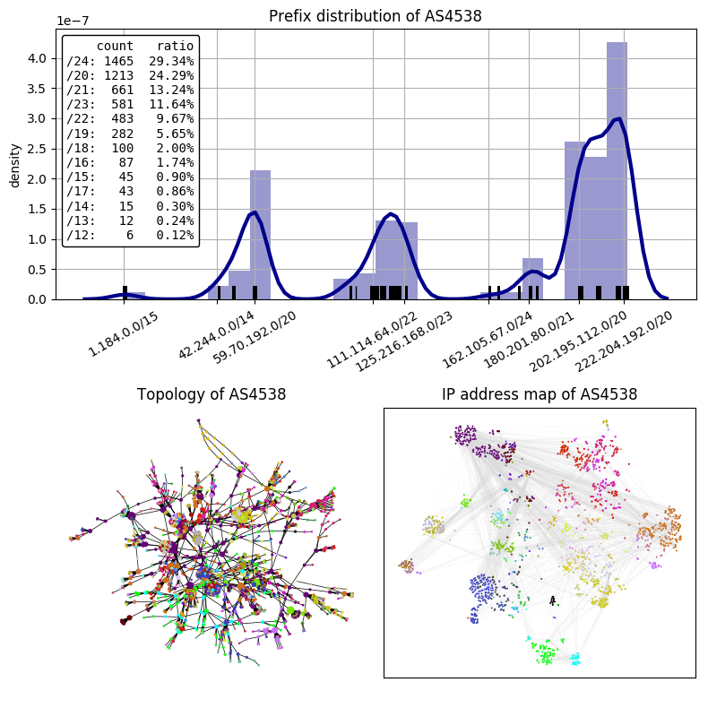
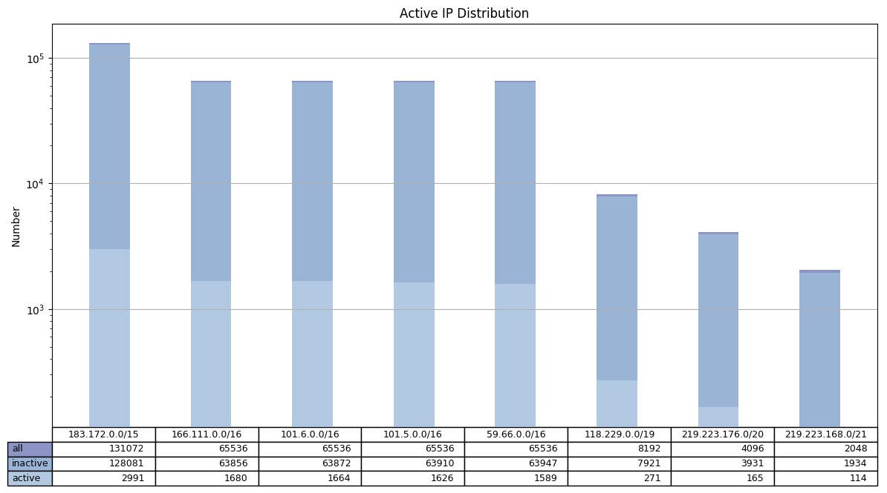
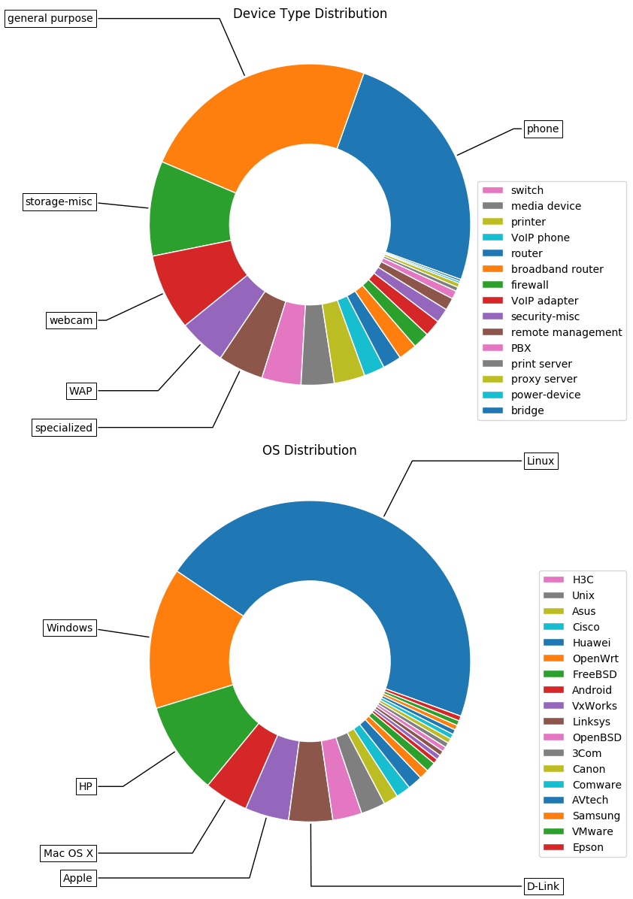

# 网络管理大作业报告

#### 组员：陈熠豪、程传杰

## 拓扑发现

-   获得 AS 信息

    -   信息来源：[RIPE NCC](https://stat.ripe.net/)
    -   对象：CERNET
    -   AS 号：AS4538
    -   Whois 记录：

        | key           | value                                       |
        | :------------ | :------------------------------------------ |
        | aut-num       | 4538                                        |
        | as-name       | ERX-CERNET-BKB                              |
        | descr         | China Education and Research Network Center |
        | descr         | Tsinghua University                         |
        | descr         | Beijing 100084                              |
        | country       | CN                                          |
        | admin-c       | JW410-AP                                    |
        | tech-c        | JW410-AP                                    |
        | abuse-c       | AC1685-AP                                   |
        | mnt-lower     | MAINT-CERNET-AP                             |
        | mnt-routes    | MAINT-CERNET-AP                             |
        | mnt-by        | APNIC-HM                                    |
        | mnt-irt       | IRT-CERNET-AP                               |
        | last-modified | 2020-09-03T09:16:15Z                        |
        | source        | APNIC                                       |

-   查询 AS4538 所宣告的前缀

    -   调用 RIPE NCC 提供的接口进行查询，获得其宣告的所有前缀

        ```python
        target = "https://stat.ripe.net/data/announced-prefixes/data.json?resource=AS4538"
        resp = json.loads(subprocess.check_output(["curl", "-s", target]).decode())
        prefixes = [r["prefix"] for r in resp["data"]["prefixes"]]
        ```

-   在各个前缀下，对每一个 /24 子网的 .1 地址进行 traceroute（不论该地址是否可达，都能获得部分的路径），并解析所得的结果。traceroute 调用如下

    ```bash
    # -4: Use IPv4
    # -n: Do not resolve IP addresses to their domain names
    # -I: Use ICMP ECHO for tracerouting
    # -q nqueries: Set the number of probes per each hop
    # -w MAX: Wait for a probe no more than MAX seconds
    traceroute -4nI -q 1 -w 2 ${IP_ADDRESS}
    ```

    且通过多线程实现大大降低了时间开销

    ```python
    n_worker = min(2**(24-prefix.prefixlen), 256) # one thread for each trace (no more than 256)
    with ThreadPoolExecutor(max_workers=n_worker) as executor:
        traces = list(filter(lambda x: x is not None, executor.map(worker, subnets)))
    ```

-   获得以上数据后，进行分析和展示

    

    -   Prefix distribution of AS4538：AS4538 所宣告前缀的分布情况。如图所示，横轴表示 IPv4 的地址空间（抽样显示部分前缀），纵轴表示所拥有的 ip 地址的分布密度。CERNET 所拥有的地址大致分为六个 cluster，且 202.\*.\*.\*-222.\*.\*.\* 的地址最多。左上角同时展示了前缀长度的分布情况，可以看出 /24 等较长的细碎的前缀很多，而较短的前缀（最短仅为 /12）很少，这在某些程度上说明 CERNET 所掌握的 ip 资源其实不是很富裕。（相对的，CERNET 所宣告的 IPv6 前缀则为一条 /48 的前缀。）
    -   Topology of AS4538：AS4538 的内部拓扑。该图基于 traceroute 数据绘制，每一个节点都是一个可达的设备（边缘节点为网关，中间节点为路由设备），节点的大小正比于其度数，节点颜色使用 ip 地址的最高 3 个 byte 作为 RGB 值，因此相近的地址颜色也较相近。从该图中可以明显看出，大部分的节点度数较小，为边缘节点（大部分为科研院校的接入网关），而少数节点度数较大，（很可能）为教育网主干节点。同时我们也对节点所属网段的登记信息进行了查询，可以将节点对应到全国的各个单位。度数最高的一些节点信息如下，完整的表格请查看附件

        <table border="1" class="dataframe">
          <thead>
            <tr style="text-align: right;">
              <th></th>
              <th>name</th>
              <th>descr</th>
              <th>instances</th>
              <th>degree_max</th>
            </tr>
          </thead>
          <tbody>
            <tr>
              <th>0</th>
              <td>CER2113-CN</td>
              <td>Cernet Corporation NOC Beijing 100084, China</td>
              <td>132</td>
              <td>122</td>
            </tr>
            <tr>
              <th>1</th>
              <td>IANA-NETBLOCK-172</td>
              <td>无</td>
              <td>12</td>
              <td>87</td>
            </tr>
            <tr>
              <th>2</th>
              <td>TSINGHUA-CN</td>
              <td>() Tsinghua University Teachers residential Areas Beijing 100084, China</td>
              <td>22</td>
              <td>42</td>
            </tr>
            <tr>
              <th>3</th>
              <td>CQERNET-CN</td>
              <td>Chongqing Education And Research Network Center Chongqing 400044, China</td>
              <td>11</td>
              <td>39</td>
            </tr>
            <tr>
              <th>4</th>
              <td>TSINGHUA-CN</td>
              <td>Tsinghua University Beijing 100084, China</td>
              <td>128</td>
              <td>38</td>
            </tr>
            <tr>
              <th>5</th>
              <td>ZJERNET-CN</td>
              <td>Zhejiang Province Education and Research Network Hangzhou, Zhejiang 310027, China</td>
              <td>19</td>
              <td>36</td>
            </tr>
            <tr>
              <th>6</th>
              <td>BJCOMP-CN</td>
              <td>CERNET super computer center Beijing</td>
              <td>39</td>
              <td>34</td>
            </tr>
            <tr>
              <th>7</th>
              <td>CERNETWLAN-CN</td>
              <td>CERNET Corp. Beijing, Beijing 100084, China</td>
              <td>18</td>
              <td>21</td>
            </tr>
            <tr>
              <th>8</th>
              <td>CERBKB-CN</td>
              <td>China Education and Research Network Backbone China Education and Research Network Center Tsinghua University Beijing, 100084</td>
              <td>57</td>
              <td>20</td>
            </tr>
            <tr>
              <th>9</th>
              <td>SCERNET-CN</td>
              <td>Sichuan Province Education &amp; Research Network Center Cheng Du, Sichuan 610054, China</td>
              <td>23</td>
              <td>20</td>
            </tr>
          </tbody>
        </table>

    -   IP address map of AS4538：AS4538 基于 IP 地址聚类后的内部拓扑。前一图主要从连通性的角度刻画网络拓扑，但没有很好的将地址聚类，看上去较乱，所以我们进一步通过 PCA 和 t-SNE 的方法对 ip 向量进行了降维和聚类，使得拓扑图能够更好地反映 ip 的分布。通过该图可以看出，不同地址群在拓扑中扮演的角色不同，有些作为边缘的接入网，而有些是作为中间的传输网，整体上路径的跳数不是很大，反映出 CERNET 网络的功能层次

## 资产扫描

-   选择扫描网段：考虑到 CERNET 范围太大，而清华校园网是 CERNET 的子集，故选取了清华网段进行扫描
-   扫描方法

    -   使用 masscan 进行快速高并发的大规模端口扫描，获取活跃节点。调用命令如下

        ```bash
        # --rate <packets-per-second>
        # -p <ports>
        # --ping: indicates that the scan should include an ICMP echo request
        masscan ${PREFIX} --rate 10000 -p80 --ping
        ```

    -   使用 nmap 对上一步得到的活跃节点进行进一步扫描，获取 OS、设备信息。调用命令如下

        ```bash
        # -n/-R: Never do DNS resolution/Always resolve [default: sometimes]
        # -F: Fast mode - Scan fewer ports than the default scan
        # -A: Enable OS detection, version detection, script scanning, and traceroute
        nmap -nFA ${IP_ADDRESS}
        ```

-   获得以上数据后，进行分析和展示

    

    -   Active IP Distribution：活跃节点数量在各个前缀下的分布。由于测得的活跃节点数量远少于前缀的地址空间大小，所以纵轴取了对数，可以看出存在数量级上的差异。此图说明清华网段下的大部分地址都处在非活跃状态，仅有少部分是可被扫描得到的

    

    -   Device Type Distribution：设备类型分布。大部分扫描（包含推测）的设备类型为手机、通用计算机、存储嵌入式设备、摄像头、无线 AP、特种设备等
    -   OS Distribution：操作系统分布。大部分扫描（包含推测）的操作系统类型为 Linux、Windows、HP 自研系统、Mac OS X、Apple 其他系统、D-Link 路由设备系统等

## 总结

-   拓扑发现和资产扫描对于理解一个特定的网络有很大的帮助，同时我们也清楚，现实中的网络十分复杂，我们的实验结果一定是不准确的，我们也发现网络测量实验存在许多特别之处，比如耗时长、不稳定、难复现等，单纯从网络使用者的视角来看，其实是很难全面理解网络的。但同时网络上也存在许多资源和数据可供查询，比如 RIPE NCC 集成的接口，可以方便地让我们从网络管理者的视角来看待问题。充分利用这些资源可以更好地帮助我们多维度地理解网络

---
